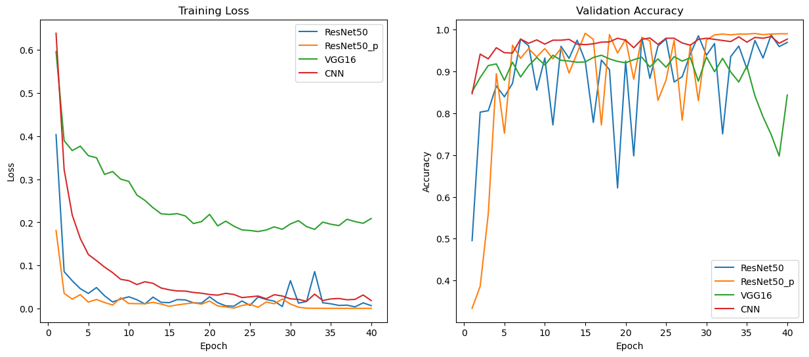

# Dialect Classification

## Introduction

This project aims to classify Chinese dialects based on speech data by extracting key features from audio recordings and training deep learning models. The project focuses on dialects from Sichuan and Nanchang, with a comparative analysis of speech characteristics from three regions. The classification models use Mel-spectrograms for training, and different architectures are employed to achieve accurate classification.

## Task 1: Speech Data Preprocessing and Visualization

### 1.1 Basic Speech Data Processing
- Preprocessing involves standard steps such as audio normalization, resampling, and trimming silence. The audio data is transformed into a format suitable for feature extraction and visualization.

### 1.2 Feature Extraction (Time-Domain and Frequency-Domain)
- **Time-Domain Features**: These include basic speech signal properties such as amplitude and pitch over time.
- **Frequency-Domain Features**: Mel-frequency cepstral coefficients (MFCCs) and log-mel spectrograms are extracted to analyze the frequency content of the audio.

### 1.3 Visualization and Comparison
- Visualize both the time-domain and frequency-domain features for Sichuan and Nanchang dialects.
- The feature comparison highlights key differences between the dialects from three regions, aiding in understanding how speech varies across these areas.

## Task 2: Dialect Classification Model Training Using Mel-Spectrograms

### 2.1 Preprocessing for Model Input
- **DataGenerator**: Custom data generators are used to feed preprocessed Mel-spectrograms into the models in batches.
- **Trainset Display**: Visualize and display the distribution of training data, providing insight into the class balance and variability within the dataset.

### 2.2 Model Architectures
A variety of model architectures are used to train and classify dialects based on the extracted Mel-spectrograms:

- **ResNet50**: A deep residual network that captures hierarchical features from the speech data to improve classification accuracy.
- **RenNet50 (Transfer-Learning - ImageNet)**: Transfer learning is applied using a pre-trained ResNet50 on the ImageNet dataset, fine-tuning it for dialect classification tasks.
- **VGG16**: This CNN architecture, known for its simplicity, is applied to capture spatial and temporal patterns in the spectrograms.
- **CNN**: A custom convolutional neural network built from scratch for this specific classification task, optimized for speech data.

### 2.3 Model Training
- The models are trained using the preprocessed Mel-spectrograms with hyperparameter tuning (learning rate, batch size, epochs, etc.). Training is monitored using metrics such as loss and accuracy.

### 2.4 Results and Comments
- After training, the models are evaluated on a test set. Metrics such as accuracy, precision, recall, and F1-score are used to assess the performance of each model.
- Visualization of confusion matrices and classification reports are included to provide insights into model performance.
- Based on these results, comments are provided on the strengths and weaknesses of each architecture, as well as the effectiveness of using Mel-spectrograms for dialect classification.

**Remark** Due to the large size of the dataset, it has not been uploaded to the repository. Please contact me if you need access to the dataset